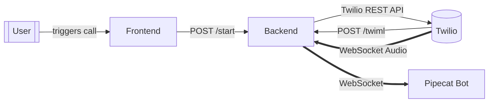

# System Overview

This system places outbound voice calls using Twilio, connects media via Twilio Media Streams to a Pipecat-based bot, and presents data in a Next.js dashboard.

## Components

- Frontend: Next.js (App Router), TypeScript, Tailwind v4
- Backend: FastAPI server
- Telephony: Twilio Voice + Media Streams
- Bot runtime: Pipecat (local dev) or Pipecat Cloud (production)

## Diagram

## Environments

- Local: `ENV=local` (WebSocket endpoint is the local server `/ws`)
- Production: `ENV=production` (WebSocket routes to Pipecat Cloud; requires `AGENT_NAME` and `ORGANIZATION_NAME`)

## Key Ports

- Backend: `7860`
- Frontend: `3000`

