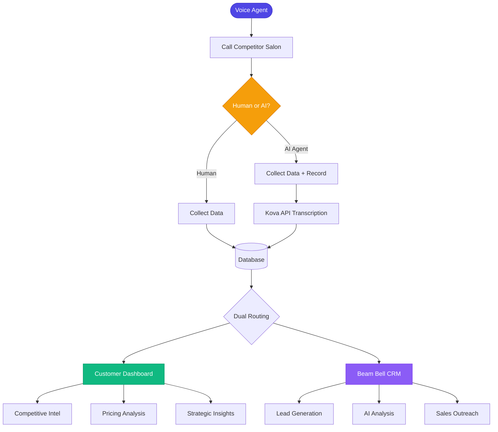
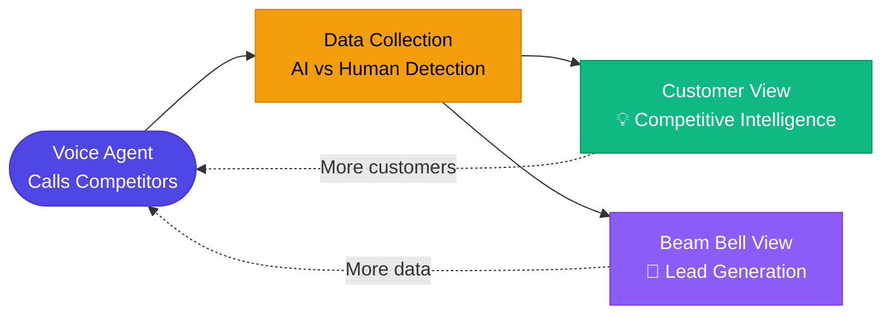

# PRP: Minimal Beautiful Mermaid Diagram for Pitch Deck

## Feature Overview

Create a minimal, professional Mermaid.js flowchart diagram that visualizes the Beam Bell competitive intelligence platform's dual value proposition for inclusion in a pitch deck. The diagram should clearly show:

1. Voice agent calling competitor salons
2. AI vs Human detection mechanism
3. Dual routing to Customer Dashboard and Beam Bell CRM
4. The "network effect" that creates value for both customers and Beam Bell

**Target Output**: A single, clean diagram that can be rendered in multiple contexts:
- Standalone HTML page for export
- React component for Next.js app
- Exportable SVG/PNG for presentations

---

## Context & Research Findings

### Project Environment
- **Tech Stack**: Next.js 15.5.4, React 19.1.0, TypeScript 5, Tailwind CSS 4
- **Build Tool**: Turbopack
- **Current State**: No existing Mermaid.js implementation
- **Location**: `/home/parsa/allGitHubRepos/yc_hackathon/frontend`

### Source Material Analysis

Based on `USER-JOURNEY-DIAGRAM.md`, the key flows to visualize are:

1. **Call Flow**:
   ```
   Voice Agent → Competitor Salon → [Human OR AI Detection] → Data Collection
   ```

2. **Dual Routing**:
   ```
   Data Storage → Routes to BOTH:
   - Customer Dashboard (Mike's View): Competitive intel, pricing, analytics
   - Beam Bell CRM (Internal): Lead generation, AI analysis, sales outreach
   ```

3. **Value Proposition**:
   - **For Customers**: Competitive intelligence, pricing insights, strategic recommendations
   - **For Beam Bell**: Automated lead generation from every data collection call

### Mermaid.js Integration Research

**Official Documentation**:
- Main docs: https://mermaid.js.org/
- Flowchart syntax: https://mermaid.js.org/syntax/flowchart.html
- Theming: https://mermaid.js.org/config/theming.html
- Examples: https://mermaid.js.org/syntax/examples.html

**React Integration Options** (from web search):

1. **NPM Package**: `@lightenna/react-mermaid-diagram`
   - Requires `'use client'` directive for Next.js App Router
   - Simple component-based approach

2. **Custom Implementation**:
   - Direct mermaid.js library import
   - Manual initialization with unique IDs
   - Better control for customization

3. **Markdown + Rehype** (for MDX content):
   - `rehype-raw` plugin
   - CDN script loading
   - Server-side rendering considerations

**Recommended Approach for This Project**: Custom React component with direct mermaid.js integration for maximum styling control.

### Styling Best Practices (Pitch Deck Context)

**Theme Selection**:
- **`neutral`**: Best for presentations, black/white print-friendly
- **`base`**: Only fully customizable theme, recommended for custom branding

**Custom Theme Variables** (for professional/minimal look):
```javascript
{
  theme: 'base',
  themeVariables: {
    // Professional color palette
    primaryColor: '#4F46E5',      // Indigo for primary actions
    primaryTextColor: '#FFFFFF',
    primaryBorderColor: '#4338CA',

    secondaryColor: '#F3F4F6',    // Light gray for backgrounds
    secondaryTextColor: '#1F2937',
    secondaryBorderColor: '#D1D5DB',

    tertiaryColor: '#10B981',     // Green for success/growth
    tertiaryTextColor: '#FFFFFF',
    tertiaryBorderColor: '#059669',

    // Typography
    fontFamily: 'Inter, system-ui, sans-serif',
    fontSize: '16px',

    // Lines and connections
    lineColor: '#6B7280',

    // Background
    background: '#FFFFFF'
  }
}
```

**Key Styling Principles**:
1. Use hex colors only (color names not recognized)
2. Maintain high contrast for readability
3. Limit to 2-3 primary colors
4. Use clean, sans-serif fonts
5. Keep node shapes consistent
6. Minimize text in nodes (use clear, concise labels)

### Diagram Design Approach

**Layout Strategy**:
- **Top-to-bottom (TB) direction**: Natural reading flow for presentations
- **Subgraphs**: Group related components visually
- **New Shape Options**: Leverage Mermaid's 30+ shapes for semantic clarity
  - Rectangles for processes
  - Rounded rectangles for systems/actors
  - Diamonds for decision points
  - Parallelograms for data/input
  - Cylinders for storage

**Simplification for Pitch Deck**:
- Combine detailed steps into high-level flows
- Focus on the "why" not the "how"
- Highlight the dual value proposition
- Use color strategically to draw attention to key points

---

## Implementation Blueprint

### Pseudocode Architecture

```typescript
// 1. Install dependencies
npm install mermaid
npm install --save-dev @types/mermaid

// 2. Create reusable Mermaid component
// File: frontend/src/components/MermaidDiagram.tsx
'use client';

interface MermaidDiagramProps {
  chart: string;
  config?: any;
}

export function MermaidDiagram({ chart, config }) {
  // Use effect to initialize mermaid on mount
  // Generate unique ID for diagram
  // Render diagram in div with unique ID
  // Return rendered SVG
}

// 3. Create diagram content constant
// File: frontend/src/lib/pitch-deck-diagram.ts
export const PITCH_DECK_DIAGRAM = `
%%{init: {'theme':'base', 'themeVariables': {
  'primaryColor': '#4F46E5',
  'primaryTextColor': '#FFFFFF',
  'primaryBorderColor': '#4338CA',
  ...
}}}%%

flowchart TB
  [Diagram syntax here]
`;

// 4. Create page/component to display diagram
// File: frontend/src/app/diagram/page.tsx
import { MermaidDiagram } from '@/components/MermaidDiagram';
import { PITCH_DECK_DIAGRAM } from '@/lib/pitch-deck-diagram';

export default function DiagramPage() {
  return (
    <div>
      <MermaidDiagram chart={PITCH_DECK_DIAGRAM} />
      <button>Export as SVG</button>
      <button>Export as PNG</button>
    </div>
  );
}
```

### Diagram Content Structure

Based on the USER-JOURNEY-DIAGRAM.md, here's the high-level flow:



**Simplified version for pitch deck** (more concise):



---

## Implementation Tasks (In Order)

### Phase 1: Setup and Dependencies
1. Install mermaid.js library
   ```bash
   cd frontend
   npm install mermaid
   npm install --save-dev @types/mermaid
   ```

2. Verify installation and check version
   ```bash
   npm list mermaid
   ```

### Phase 2: Create Reusable Components

3. Create MermaidDiagram React component
   - File: `frontend/src/components/MermaidDiagram.tsx`
   - Implement 'use client' directive
   - Add useEffect hook for mermaid initialization
   - Generate unique IDs to prevent diagram mixing
   - Handle errors gracefully
   - Add export functionality (SVG)

4. Create diagram content constants
   - File: `frontend/src/lib/pitch-deck-diagram.ts`
   - Export 3 diagram versions:
     - `PITCH_DECK_SIMPLE`: Minimal flow (for slides)
     - `PITCH_DECK_DETAILED`: Comprehensive flow (for deep dives)
     - `PITCH_DECK_COMPARISON`: Side-by-side Human vs AI paths
   - Include theme configuration in init block

### Phase 3: Page/Route Implementation

5. Create diagram showcase page
   - File: `frontend/src/app/diagram/page.tsx`
   - Display all diagram variants with tabs/sections
   - Add export buttons
   - Include download as SVG/PNG functionality
   - Add copy-to-clipboard for mermaid syntax

6. Style the page with Tailwind
   - Clean, minimal layout
   - Responsive design
   - Print-friendly styles
   - Dark mode support (optional)

### Phase 4: Export and Utilities

7. Implement SVG export functionality
   - Use mermaid's built-in SVG generation
   - Add download trigger
   - Filename with timestamp

8. Implement PNG export (optional, advanced)
   - Use canvas API to convert SVG to PNG
   - Set appropriate resolution for presentations
   - Background color options

9. Create standalone HTML export
   - File: `frontend/public/diagram-standalone.html`
   - Self-contained HTML with CDN mermaid.js
   - Can be opened directly in browser
   - Easy to share without running dev server

### Phase 5: Documentation and Polish

10. Add README for diagram usage
    - File: `frontend/src/lib/README-DIAGRAMS.md`
    - Document how to use MermaidDiagram component
    - Include examples
    - Customization guide
    - Export instructions

11. Add TypeScript types
    - Create proper interfaces for component props
    - Type the diagram configuration
    - Export types for reuse

12. Test across browsers
    - Chrome/Edge
    - Firefox
    - Safari
    - Mobile responsiveness

---

## Validation Gates

### Syntax/Type Checking
```bash
cd frontend
npm run lint
npx tsc --noEmit
```

### Build Verification
```bash
npm run build
```
- Should complete without errors
- Check for mermaid.js bundle size warnings

### Runtime Testing
```bash
npm run dev
```
- Navigate to `/diagram` route
- Verify all diagrams render correctly
- Test export functionality
- Check console for errors

### Visual QA Checklist
- [ ] Diagrams render without overlapping text
- [ ] Colors are professional and consistent
- [ ] Fonts are readable at presentation size
- [ ] Export generates clean SVG
- [ ] Layout works on mobile (responsive)
- [ ] No console errors or warnings
- [ ] Diagrams render in under 2 seconds

### Accessibility
- [ ] SVG has proper title/desc tags
- [ ] Color contrast meets WCAG AA standards
- [ ] Diagrams are understandable without color (for colorblind users)

---

## Gotchas and Important Notes

### Common Issues

1. **Diagram Mixing in React**: When rendering multiple diagrams, they can get mixed up
   - Solution: Use unique IDs for each diagram instance
   - Implementation: `const id = useId()` or `crypto.randomUUID()`

2. **SSR/Hydration Issues**: Mermaid requires browser environment
   - Solution: Use 'use client' directive
   - Use useEffect to initialize after mount

3. **Theme Variables**: Color names don't work, only hex codes
   - Bad: `primaryColor: 'blue'`
   - Good: `primaryColor: '#4F46E5'`

4. **Font Loading**: Custom fonts may not load in exported SVG
   - Solution: Use system fonts or embed fonts
   - Test exported SVGs independently

5. **Large Diagrams**: Complex diagrams can have layout issues
   - Solution: Use `elk` renderer for better layout
   - Simplify diagram for pitch deck context

### Performance Considerations

- Mermaid initialization adds ~50-100KB to bundle
- Lazy load the component if not used on main page
- Consider dynamic import for diagram page only

### Best Practices from Research

1. **Keep it Simple**: For pitch decks, less is more
2. **Test Early**: Render diagrams early to catch layout issues
3. **Version Control**: Keep diagram syntax in separate files for easy editing
4. **Iterate**: Start with simple version, add complexity as needed
5. **Get Feedback**: Test diagrams with non-technical people to ensure clarity

---

## Reference Links

### Official Documentation
- Mermaid.js Docs: https://mermaid.js.org/
- Flowchart Syntax: https://mermaid.js.org/syntax/flowchart.html
- Theming Guide: https://mermaid.js.org/config/theming.html
- Configuration: https://mermaid.js.org/config/configuration.html

### Integration Guides
- Next.js Integration: https://www.andynanopoulos.com/blog/how-to-integrate-next-react-mermaid-markdown
- React Component Package: https://www.npmjs.com/package/@lightenna/react-mermaid-diagram
- Medium Guide: https://medium.com/@Hughjanus123/integrating-mermaidjs-with-react-ae0fdc0db867

### Examples and Inspiration
- Mermaid Examples Gallery: https://mermaid.js.org/syntax/examples.html
- ClickUp Mermaid Guide: https://clickup.com/blog/mermaid-diagram-examples/
- GitHub Theming Examples: https://github.com/Gordonby/MermaidTheming

---

## Success Criteria

This implementation is considered successful when:

1. ✅ A minimal, professional diagram renders correctly
2. ✅ Diagram can be exported as SVG for presentations
3. ✅ Component is reusable for future diagrams
4. ✅ No console errors or TypeScript issues
5. ✅ Build completes successfully
6. ✅ Diagram clearly communicates the dual value proposition
7. ✅ Colors and styling are pitch-deck appropriate
8. ✅ Exported SVG is high quality and scalable

---

## Confidence Score: 8.5/10

**Rationale**:
- ✅ Clear technical approach with proven libraries
- ✅ Comprehensive research on integration patterns
- ✅ Well-documented theming and styling options
- ✅ Existing Next.js project setup is compatible
- ✅ Source material (USER-JOURNEY-DIAGRAM.md) is clear
- ⚠️ Minor uncertainty around optimal diagram simplification for pitch context
- ⚠️ May need iteration on styling to match brand preferences
- ✅ All validation gates are executable and clear

**Expected Implementation Time**: 2-3 hours for full implementation with all phases

---

## Example Code Snippets

### MermaidDiagram Component (Starter)

```typescript
'use client';

import { useEffect, useId } from 'react';
import mermaid from 'mermaid';

interface MermaidDiagramProps {
  chart: string;
  className?: string;
}

export function MermaidDiagram({ chart, className = '' }: MermaidDiagramProps) {
  const id = `mermaid-${useId().replace(/:/g, '')}`;

  useEffect(() => {
    mermaid.initialize({
      startOnLoad: false,
      theme: 'base',
    });

    const renderDiagram = async () => {
      const element = document.getElementById(id);
      if (element) {
        try {
          const { svg } = await mermaid.render(id + '-svg', chart);
          element.innerHTML = svg;
        } catch (error) {
          console.error('Mermaid rendering error:', error);
          element.innerHTML = '<p>Error rendering diagram</p>';
        }
      }
    };

    renderDiagram();
  }, [chart, id]);

  return <div id={id} className={className} />;
}
```

### Diagram Constants (Starter)

```typescript
export const PITCH_DECK_SIMPLE = `
%%{init: {'theme':'base', 'themeVariables': {
  'primaryColor': '#4F46E5',
  'primaryTextColor': '#FFFFFF',
  'primaryBorderColor': '#4338CA',
  'secondaryColor': '#10B981',
  'secondaryTextColor': '#FFFFFF',
  'secondaryBorderColor': '#059669',
  'tertiaryColor': '#8B5CF6',
  'tertiaryTextColor': '#FFFFFF',
  'tertiaryBorderColor': '#7C3AED',
  'lineColor': '#6B7280',
  'fontFamily': 'Inter, system-ui, sans-serif',
  'fontSize': '16px'
}}}%%

flowchart LR
    VA([Voice Agent<br/>Calls Competitors]) --> DC[Data Collection<br/>AI vs Human Detection]

    DC --> CD[Customer Dashboard<br/>Competitive Intelligence]
    DC --> BB[Beam Bell CRM<br/>Lead Generation]

    CD -.->|More Customers| VA
    BB -.->|More Data| VA

    style VA fill:#4F46E5,stroke:#4338CA,color:#FFFFFF
    style DC fill:#F59E0B,stroke:#D97706,color:#000000
    style CD fill:#10B981,stroke:#059669,color:#FFFFFF
    style BB fill:#8B5CF6,stroke:#7C3AED,color:#FFFFFF
`;
```

---

**Document Version**: 1.0
**Created**: 2025-10-11
**AI Agent Note**: This PRP contains all necessary context for one-pass implementation. Follow phases sequentially, validate after each phase, and iterate on diagram design based on visual output.
